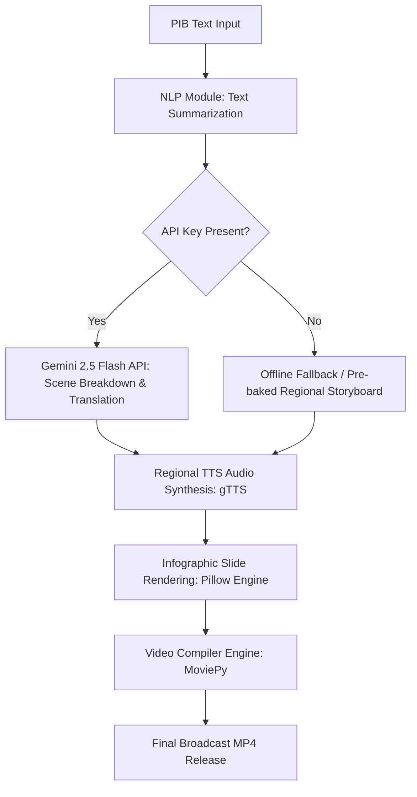

# PIB Text-To-Video Platform (PIB-TV)

An advanced, production-ready AI-powered web platform designed to ingest Press Information Bureau (PIB) releases, summarize the text, translate the summary into Indic regional languages, synthesize localized voiceovers, and assemble infographic video releases. 

---

## 🌟 Key Features

- **End-to-End Automated Pipeline**: Processes raw press release text into a completed broadcast-style MP4 in seconds.
- **Support for English & 13 Regional Languages**: Includes Hindi, Bengali, Marathi, Telugu, Tamil, Gujarati, Urdu, Kannada, Odia, Malayalam, Punjabi, Assamese, and Sanskrit.
- **Hybrid AI Engine**:
  - **Dynamic AI Mode**: Fully automated, structural generation via Google Gemini API (utilizing Pydantic models for structured output parsing).
  - **Local/Offline Mode**: A robust fallback system that parses input text offline. For the sample Gaganyaan press release, it utilizes pre-baked high-fidelity translations.
- **Glassmorphic Infographic Layout Engine**: A custom drawing engine built with Pillow that creates beautiful, modern dark-themed slides featuring:
  - Vertical linear gradients.
  - Saffron, White, and Green Indian tricolor accent bar.
  - Header branding banners.
  - Translucent glass cards with glowing outlines.
  - Indic font support utilizing `Nirmala.ttc`.
  - Automated progress timeline indicators.
- **Synchronous Speech Integration**: Uses gTTS (Google Text-To-Speech) and MoviePy to dynamically synchronize the visual cards with the generated regional audio duration.
- **Real-Time Progress Tracking**: Uses Server-Sent Events (SSE) to stream generation phases (`NLP Summarization` ➡️ `Translation` ➡️ `Voice Synthesis` ➡️ `Visual Rendering` ➡️ `Stitching`) to the frontend in real time.
- **Secure Authentication**: Built-in SQLite authentication with encrypted password hashing.

---

## 📐 Architecture Pipeline



---

## 🚀 Quick Start Guide

### Prerequisites
- Python 3.8 or higher.
- `ffmpeg` installed on the system and added to your PATH environment variable (required by MoviePy for video stitching).

### 1. Installation
Clone the repository and set up a Python virtual environment:
```bash
# Setup virtual environment
python -m venv .venv
.venv\Scripts\activate # On Windows PowerShell
source .venv/bin/activate # On Unix/macOS

# Install dependencies
pip install Flask gTTS MoviePy pillow google-genai pydantic requests numpy opencv-python-headless
```

### 2. Run the Application
Start the Flask development server:
```bash
python app.py
```
Open your browser and navigate to `http://127.0.0.1:5000`.

---

## 🔐 Testing Credentials

For convenient evaluation, the local SQLite database is pre-seeded on startup with the following testing credentials:
- **Username**: `admin`
- **Password**: `admin`

---

## 📁 Repository Structure

```text
├── app.py                  # Core backend routes, auth, and generation pipeline
├── database.db             # SQLite database file (ignored in git)
├── static/
│   ├── css/
│   │   └── style.css       # Premium glassmorphism design layouts & animations
│   ├── js/
│   │   └── main.js         # SSE stream listener and AJAX submission logic
│   └── output/             # Temp and completed video/audio files (ignored in git)
├── templates/
│   ├── base.html           # Master navigation & visual structure
│   ├── home.html           # Main pipeline landing page
│   ├── login.html          # Authentication logins
│   ├── signup.html         # User registration form
│   └── video_gen.html      # Text-to-Video control center workspace
└── .gitignore              # Git ignore rules
```

---

## 🛠️ Usage Flow
1. Log in to the portal using the credentials `admin` / `admin`.
2. Click **Load Sample PIB Release** to import the demonstration text regarding the ISRO Gaganyaan mission.
3. Select your target language (e.g., **Hindi** or **Tamil**).
4. Leave the API Key field blank to utilize the offline high-quality translation fallback, or enter your **Gemini API Key** for real-time translation of arbitrary text.
5. Click **Generate Video Release**.
6. Track the real-time compilation steps as the system builds the video and displays it in the player upon completion.