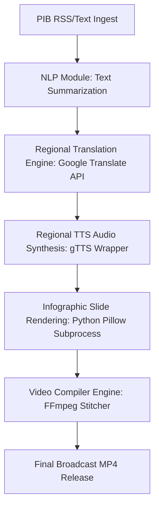

# PIB Multilingual Text-To-Video Platform (PIB-TV)

An advanced, production-ready AI-powered web platform designed to ingest Press Information Bureau (PIB) releases, summarize the text, translate the summary into 13 Indic regional languages, synthesize localized voiceovers, and assemble infographic video releases. 

---

## 🌟 Key Features

- **End-to-End Automated Pipeline**: Processes raw press release text into a completed broadcast-style MP4 in seconds.
- **Modern Full-Stack Architecture**:
  - **Frontend**: React (Vite, Tailwind CSS, Redux Toolkit, Lucide Icons, Glassmorphic UI).
  - **Backend**: Node.js, Express, TypeScript, Prisma ORM with SQLite.
- **Support for English & 13 Regional Languages**: Includes Hindi, Tamil, Telugu, Kannada, Malayalam, Bengali, Gujarati, Marathi, Punjabi, Odia, Urdu, Assamese, and Sanskrit.
- **Dynamic Translation & Regional Audio**:
  - Automatically translates press release summaries and slide headlines to the target language via integrated Google Translate.
  - Dynamically synthesizes native-sounding speech with `gTTS` utilizing a custom wrapper bypassing library validation checks.
- **Glassmorphic Infographic Layout Engine**: A custom Python drawing engine built with Pillow that creates beautiful, modern dark-themed slides featuring:
  - Vertical linear gradients & tricolor accent bar (Saffron, White, Green).
  - Translucent glass cards with glowing outlines.
  - AI Presenter avatar overlay.
  - Indic font support utilizing `Nirmala.ttc`.
  - Automated progress timeline indicators.
- **Resilient RSS Parsing**: Permissive, regex-based tag extractor bypassing malformed XML entities (such as bare ampersands `&`) from live PIB feeds.
- **Real-Time Progress Tracking**: Uses Server-Sent Events (SSE) to stream generation phases (`NLP` ➡️ `Translation` ➡️ `Voice Synthesis` ➡️ `Visual Rendering` ➡️ `Stitching`) to the frontend in real time.
- **Secure Authentication**: Built-in JWT authentication with SQLite credentials.

---

## 📐 Architecture Pipeline



---

## 🚀 Quick Start Guide

### Prerequisites
- Node.js (v18+)
- Python 3.8+
- `ffmpeg` installed on the system and added to your PATH environment variable.

### 1. Installation
Install all root, backend, and frontend dependencies:
```bash
# Install root dependencies
npm install

# Install backend dependencies
cd backend
npm install
npx prisma db push

# Install frontend dependencies
cd ../frontend
npm install

# Set up Python Virtual Environment (from workspace root)
cd ..
python -m venv .venv
.venv\Scripts\activate # On Windows
source .venv/bin/activate # On Unix/macOS
pip install pillow requests numpy opencv-python-headless
```

### 2. Run the Application
Start the development servers concurrently from the root directory:
```bash
npm run dev
```
Open your browser and navigate to **`http://localhost:3000`**.

---

## 🔐 Testing Credentials

For convenient evaluation, the local SQLite database is pre-seeded on startup with the following testing credentials:
- **Username**: `admin`
- **Password**: `admin`

---

## 📁 Repository Structure

```text
├── backend/                # Express, TypeScript, Prisma SQLite backend
│   ├── prisma/             # Schema definitions and migrations
│   ├── src/                # Authentication, RSS, and compilation pipeline routes
│   └── tsconfig.json       # TypeScript configuration
├── frontend/               # React, Vite, Tailwind CSS frontend
│   ├── src/                # UI components, pages, slices, store
│   └── vite.config.ts      # Proxy settings for dev server
├── scripts/                # Python processing scripts
│   ├── slide_renderer.py   # Renders 1920x1080 slide frames
│   └── ai_anchor.png       # Avatar image for visual generation
├── package.json            # Root configuration for concurrent launch
└── .gitignore              # Git ignore rules
```

---

## 🛠️ Usage Flow
1. Log in to the portal using the credentials `admin` / `admin`.
2. Click **Fetch PIB RSS Feed** to ingest live news items.
3. Select a release from the list, choose your target regional language (e.g. **తెలుగు (Telugu)** or **मराठी (Marathi)**).
4. Click **Build Storyboard** to generate the translated narration cards.
5. Click **Stitch & Compile Video Release** to compile the video.
6. Track the real-time compilation steps as the system builds the video and displays it in the player upon completion.